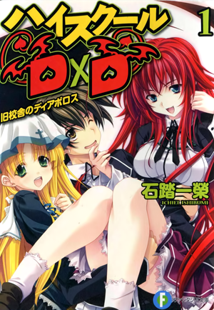
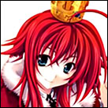

<html>
 <body>
 

'''''High School D×D''''' (ハイスクールD×D, ''Haisukūru D×D'') je serija Japanskih light novela, koju je napisao Ichiei Ishibumi, a ilustriracije je odradio Miyama-Zero, izdavač je Fujimi Shobo pod njihovom Fujimi Fantasia etiketi.

Anime od 12 epizoda, napravio TNK, emitovan je od januara do marta 2012. g. OAV epizoda je došla zajedno s Limited edition Volume 13 pakiranjem.

Druga sezona anime adaptacije HSDxD-a je najavljena za 2013. g.

'''Obaveštenje nadzornika(Code-Zero):''' ''Nemojte pitati za ažuriranja! Prijevodi će izaći kad izađu! Svaki prevoditelj prijevodi na njegov ili njezin vlastiti tempo. Također nemojte kopirati prijevode na druge web adrese. 

==Sažetak==

Ja, Hyoudou Issei, idem u 2. razred Gimnazije a moja starost jednaka je godiname kada nisam imao curu. A neko poput mene je dobio curu! Žao mi je prijatelji, hodaću putem do postanka odrasle osobe pre vas momci! --Tako je barem trebalo ispasti, ali zašto me je trebala ubiti moja cura?

Još uvek nisam niš učinio! Zar nema Bogova u ovome svetu!?

A osoba koja me spasila je najlepša djevojka u školi, Rias Gremory-senpai. Doznao sam šokantnu istinu od nje, koja nije Bog, već Đavo. "Reinkarnirao si se u đavola! Radi za mene!"

Primamile su me Senpai-ine grudi i ostali delovi tela, moj život kao reinkarniranisani đavo je započeo.

I tako Akademija Ljubavne-komedije borbene fantazije započinje ovde sa samo agresivnim i željama ovoga sveta.

---''Uzeto iz sažetka 1. knjige.''

 

Prva priča: Knjige 1 & 2

Druga priča: Knjige 3-6

Treća priča: Knjige 7-12

Četvrta priča: Knjige 13-??

('''Pazite:''' ''Knjige 8 i 13 su kompilacije kratkih priča iz Dragon Magazine-a'')

==Likovi==

 '''UPOZORENJE: Sljedeći sadržaj može sadržavati spoilere. Upozoreni ste!!'''

|-
|

'''Hyoudou Issei ''' (兵藤 一誠, ''Hyōdō Issei'')

 

'''Rang/Uloga:''' Vrag niže klase -> Vrag srednje klase (Prijašnje ljudsko biće)/Pješak(x8)

'''Sacred Gear:''' Boosted Gear (Longinus) -> Boosted Gear Scale-mail (Balance-Breaker)

'''Oružje:''' Ascalon

'''Moć:''' Dress-Break, Bilingual.

Pohađa 2. razred Gimnazije. Glup, pohotljiv i pokvarenjak(pervert). Normalan gimnazijalac rođen u prosječnoj obitelji, ali posjeduje Sacred Gear "Boosted Gear" koji je naveden kao jedan od najjačih Sacred Gear-ova. Ubila ga je njegova prva cura, pali anđeo, i oživljen je kao vrag, i kao sluga od Rias Gremory, njegov novi gospodar. Cilj mu je da postane Harem-King tako što dobije pravo na plemstvo, nesvjestan da privlači djevojke oko sebe.

'''Rias Gremory''' (リアス・グレモリー, ''Riasu Guremorī'')

'''Rang/Uloga:''' Visoko rangirani vrag (Čistokrvni vrag)/Kralj

'''Moć:''' Moć razaranja 

Pohađa 3. razred gimnazije i smatraju ju Madonnom akademije. Dolazi iz stare plemenite obitelji, koji su čistokrvni vragovi, kuća Gremory, visoko rangiran vrag koji nosi nadimak "Crimson-Haired Ruin Princess". Njezin brat je zapravo jedan od četiriju vladajućih vragova, Lucifer. Ona je oživila Ise-a nakon što ga je našla mrtvog, ubijen od strane palog-anđela i posjedujući rijedak Sacred Gear. Ljubazna i meka prema njezinim slugama, postane totalno drukčija osoba kada trenira ili se bori.

'''Asia Argento''' (アーシア・アルジェント, ''Âshia Arujento'')

'''Rang/Uloga:''' Vrag niže klase (Prijašnje ljudsko biće)/Lovac

'''Sacred Gear:''' Twilight Healing

Pohađa 2. razred Gimnazije. Originalno je bila časna sestra koja je bila poznata kao Sveta-djevica zbog svojih iscjeliteljskih moći. Odgojena je u sirotištu i odvedena je u Crkvu nakon što saznali za njene moći. Izbacili su je iz Crkve zato što je izliječila vraga, pa su ju udomili ljudi povezani s palim-anđelima. Počela je živjeti zajedno s Ise-om, nakon što ju je spasio od palih-anđela, koji su htjeli oduzeti njezinu moć, Twilight Healing. Kao osoba odgojena u Crkvi, ona nema zdrav razum.

'''Himejima Akeno''' (姫島 朱乃, ''Himejima Akeno'')

'''Rang/Uloga:''' Vrag niže klase -> Vrag srednje klase(Prijašnje ljudsko biće/pali-anđeo)/Kraljica

'''Moć:''' Snaga svetog svjetla

Pohađa 3. razred Gimnazije i jedna je od „Dviju Velikih Sestara“ škole uz Rias. Zovu je ultimativnom „Kraljicom“ ostali članovi. Rođena je između ljudske majke i oca, palog-anđela. Nakon smrti njene majke, postala je Rias-ina sluga. Dovoljno je bliska s Rias da ju u privatnom životu zove njezinim imenom, ali ju zove Buchou u prisutnosti ostalih članova i pokazuje odnos gospodara-sluge u javnosti. Uporno odbija koristiti njezinu moć svjetla, koju je naslijedila od svog oca, a počela ju je koristiti nakon što ju je uvjerio Ise.

'''Yuuto Kiba''' (木場 祐斗, ''Kiba Yūto'')

 

[[File:Knight-Kiba.jpg|left|]]

'''Rang/Uloga:''' Vrag niže klase -> Vrag srednje klase (Prijašnje ljudsko biće)/Skakač

'''Sacred Gear 1:''' Sword Birth -> Sword of Betrayer (Balance-Breaker, sub-species), 

'''Sacred Gear 2:''' Blade Blacksmith -> Glory Drag Trooper(Balance-Breaker, sub-species)

'''Oružja:''' Demonic Emperor Sword Gram, Balmung, Nothung, Tyrfing, Dáinsleif, and one unnamed sword.

Pohađa 2. razred Gimnazije. Proglasio se najboljim prijateljem Ise-a, i princ škole. Bio je žrtva „Projekt:Sveti Mač“ gdje je on bio jedini preživjeli sudionik. Postao je Rias-in sluga nakon što ga spasila od smrti, ali još uvijek se zakleo na izvođenje osvete na onima koji su ga tretirali kao ispitanika i koji su mu ubili prijatelje. Također krije veliku ljutnju prema svetom maču Excalibur.

'''Toujou Koneko''' (塔城 小猫, ''Tōjō Koneko'')

[[File:Tank-Koneko.jpg|left|]]

'''Rang/Uloga:''' Vrag niže klase (Prijašnja nekomata)/Top

'''Moć:''' Sen-jutsu

Pohađa 1. razred Gimnazije. Prvobitno je umalo pogubljena od strane vragova nakon što je njezina sestra, Kuroka, ubila svog gospodara. Vrag, Lucifer, ju je branio, te ju ostavio svojoj sestri, Rias na čuvanje – postala je njezina služavka. Odbijala je koristiti moć sne-jutsu-a jer nije htjela postati ko svoja sestra. Prevladala je svoju moć zajedno s Akeno nakon što ih je Ise oboje nagovorio. Ne pokazuje nimalo emocija, te govori uvrjedljive stvari i lupi Ise-a kada radi ili razmišlja o perverznim stvarima. Pokazuje najveću brigu kada su joj drugovi u opasnosti.

'''Xenovia''' (ゼノヴィア, ''Zenovia'')

[[File:Knight-Zenovia.jpg|left|]]

'''Rang/Uloga:''' Vrag niže klase (Prijašnje ljudsko biće)/Skakač

'''Oružje:''' Excalibur Destruction(Volume 3), The Holy Sword Durandal -> Ex-Durandal.

Korisnik je Svetih mačeva, poslana od strane Crkve zajedno s Irinom da uništi ili vrati ukradene mačeve Excalibur. Nakon što je sazna da je Bog iz Biblije davno umro, odlučila se pridružiti klubu Okultnih Istraživanja kao Rias-ina služavka. Pokušava zavesti Ise-a kad god može jer želi roditi jako dijete.

'''Gasper Vladi''' (ギャスパー・ヴラディ, ''Gyasupā Buradi'')

[[File:Bishop-Gasper.jpg|left|]]

'''Rang/Uloga:''' Vrag niže klase (Prijašnje ljudsko biće/vampir)/Lovac

'''Sacred Gear:''' Forbidden Balor View

Muški polu-vampir koji se voli oblačiti kao djevojka, ima moć zaustavljanja vremena onih koje vidi ali ne može kontrolirati svoju moć. Rias ga je zapečatila pod naredbom starijih vragova sve dok ona ne postane dovoljno stara da bi ga mogla kontrolirati. Još uvijek ne može kontrolirat svoje moći, ali može napredovati ako popije Ise-jevu krv.

 

'''Rossweisse''' (ロスヴァイセ, ''Rosuvaise'')

[[File:Tank-Rossweisse.jpg|left|]]

'''Rang/Uloga:''' Vrag niže klase (Prijašnja Valkyrie-a)/Top

'''Moć:''' Norse Magics

Izvorno tjelohranitelj Odin-a. Nakon bitke s Loki-em i Fenrir-om, Odin ju ostavio u Ise-jevom gradu. Onda ju je Rias uvjerila da postane njezina služavka. Postaje učitelj u Kuou Akademiji.

'''Irina Shidou''' (紫藤イリナ, ''Shidō Irina'')

[[File:Ace-Irina.jpg|left|]]

'''Rang/Uloga:''' Anđeo (Prijašnje ljudsko biće)/As

'''Oružje:''' Excalibur Mimic(Volume 3), Mass-produced Holy-demonic sword

Ona je Xenovijin partner i Ise-jeva prijateljica iz djetinjstva. Nakon što je saznala da je Bog iz Biblije umro, još uvijek prati učenja i služi pod Michael-om. Bila je šokirana kada je saznala da je postao vrag. još uvijek su prijatelji unatoč te mane.

 

 

==Prevođenje==

===Standardi oblikovanja===

'''Svako poglavlje (nakon uređivanja) mora biti u skladu sa smjernicama za oblikovanje.'''
*[[Format_guideline|Oblikovanje/smjernice za stil]]
*[[High School DxD: Names and Terminology Guidelines]]

Prevođenje se vrši s Engleskog na Srpski. Zna se naći pogreška u Engleskoj verziji, pa se može desiti da prevedem krivo neki dio. Slobodno ispraviti greške na koje naiđete u tekstu, ako ste nešto ispravili što niste htjeli, nema problema postoji back-up na računalu.
I slobodo se pridružite prevođenju knjiga, javite se glavnom administratoru projekta ili otiđite na forum, te pitajte kako se pridružiti određenom projektu.

==''High School DxD'' serijal Ichieija Ishibumija==

===Volume 1 - Demoni stare školske zgrade ([[High School DxD: Croatian Volume 1|Čitav tekst]])===

::*[[High School DxD: Croatian Volume 1 Illustrations|Ilustracije]]

::*[[High School DxD: Croatian Volume 1 Život 0|Život.0]]

::*[[High School DxD: Croatian Volume 1 Život 1|Život.1 Odustao sam biti ljudsko biće(37%).]]

::*[[High School DxD: Croatian Volume 1 Život 2|Život.2 Počinjem kao Vrag.]]

::*[[High School DxD: Croatian Volume 1 Život 3|Život.3 Sprijateljio sam se.]]

::*[[High School DxD: Croatian Volume 1 Život 4|Život.4 Spasit ću svog prijatelja!]]

::*[[High School DxD: Croatian Volume 1 Novi Život|Novi Život.]]

::*[[High School DxD: Croatian Volume 1 Pogovor|Pogovor.]]

===Volume 2 - Phoenix u borbi za staru školsku zgradu ([[High School DxD: Croatian Volume 2|Čitav tekst]])===

::*[[High School DxD: Croatian Volume 2 Illustrations|Ilustracije]]

::*[[High School DxD: Croatian Volume 2 Život 0|Život.0]]

::*[[High School DxD: Croatian Volume 2 Život 1|Život.1 Radim kao vrag.]]

::*[[High School DxD: Croatian Volume 2 Život 2|Život.2 Potukao sam se.]]

::*[[High School DxD: Croatian Volume 2 Život 3|Život.3 Počeo sam s treningom.]]

::*[[High School DxD: Croatian Volume 2 Život 4|Život.4 Odlučujuća borba započinje!]]

::*[[High School DxD: Croatian Volume 2 Život 5|Život.5 Visoke pohvale tijekom odlučujuće borbe!]]

::**[[High School DxD: Croatian Volume 2 Šah mat|Šah mat.]]

::**[[High School DxD: Croatian Volume 2 Kraj Igre|Kraj Igre.]]

::*[[High School DxD: Croatian Volume 2 Život. ∞ vs Snaga ∞|Život. ∞ vs Snaga ∞ Došao sam ispuniti obećanje!]]

::**[[High School DxD: Croatian Volume 2 OtacxOtac|Otac x Otac.]]

::**[[High School DxD: Croatian Volume 2 Posljednji poljubac|Posljednji poljubac.]]

::*[[High School DxD: Croatian Volume 2 Novi Život|Novi Život.]]

::*[[High School DxD: Croatian Volume 2 Pogovor|Pogovor.]]

==Osoblje projekta==

*Administrator projekta: [[user:Lolwinner]]

*Nadzornik projekta: [[user:Serbian Nezuko]]

===Srpski prevoditelji===

:*[[user:Lolwinner]]

''Ako imate ikakva pitanja o određenoj knjizi, zamolio bi da pitate prevoditelja koji je radio na toj knjizi. 

===Urednici===

'''Aktivni'''
:*[[user:Lolwinner]]

'''Neaktivni'''

==Pregled serijala==

*High School D×D 1, ハイスクールD×D1 旧校舎のディアボロス (September 20, 2008 ISBN 978-4829133262)

*High School D×D 2, ハイスクールD×D2 戦闘校舎のフェニックス (December 20, 2008 ISBN 978-4829133583)

*High School D×D 3, ハイスクールD×D3 月光校庭のエクスカリバー (April 20, 2009 ISBN 978-4829133910)

*High School D×D 4, ハイスクールD×D4 停止教室のヴァンパイア (September 20, 2009 ISBN 978-4829134276)

*High School D×D 5, ハイスクールD×D5 冥界合宿のヘルキャット (December 19, 2009 ISBN 978-4829134702)

*High School D×D 6, ハイスクールD×D6 体育館裏のホーリー (March 20, 2010 ISBN 978-4829135006)

*High School D×D 7, ハイスクールD×D7 放課後のラグナロク (July 17, 2010 ISBN 978-4829135402)

*High School D×D 8, ハイスクールD×D8 アクマのおしごと (December 17, 2010 ISBN 978-4829135938)

*High School D×D 9, ハイスクールD×D9 修学旅行はパンデモニウム (April 20, 2011 ISBN 978-4829136287)

*High School D×D 10, ハイスクールD×D10 学園祭のライオンハート (September 17, 2011 ISBN 978-4829136775)

*High School D×D 11, ハイスクールD×D11 進級試験とウロボロス (January 20, 2012 ISBN 978-4829137208)

*High School D×D 12, ハイスクールD×D12 補習授業のヒーローズ (April 20, 2012 ISBN 978-4829137499)

*High School D×D 13, ハイスクールD×D13 イッセーＳＯＳ (Normal Edition - September 20, 2012 ISBN 978-4829137987)

**High School D×D 13, ハイスクールD×D13 イッセーＳＯＳ (Limited Edition - September 6, 2012 ISBN 978-4829197677)

*High School D×D 14, ハイスクールD×D14 ??? (Winter 2012-2013 ISBN ???)

*High School D×D 15, ハイスクールD×D15 ??? (Normal Edition - May ?, 2012 ISBN 978-???)

**High School D×D 15, ハイスクールD×D15 ??? (Limited Edition - May ?, 2012 ISBN 978-???)

[[Category:Light novel (Serbian)]]
</body>
</html>
